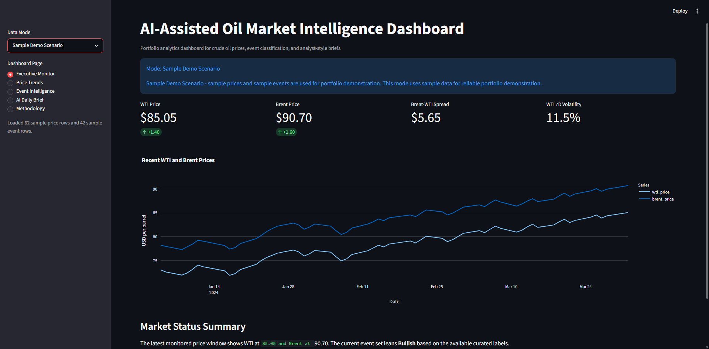
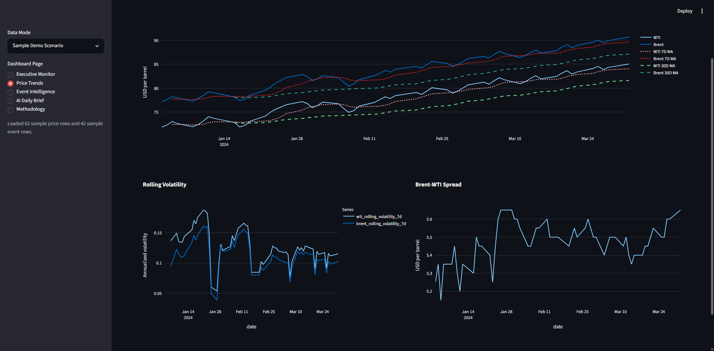
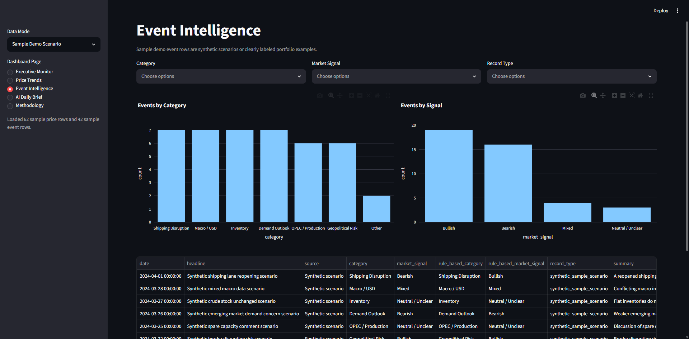
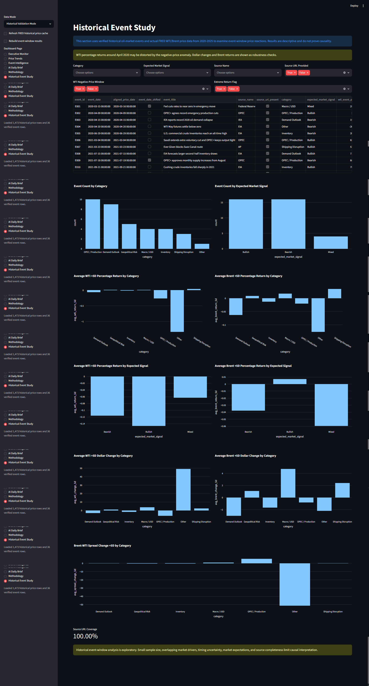
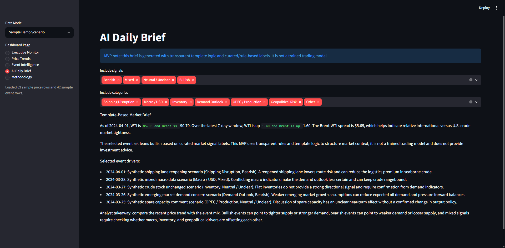

# AI-Assisted Oil Market Intelligence Dashboard

## Summary

This portfolio project is a local Python analytics dashboard for crude oil market monitoring, event classification, historical event-window analysis, and template-based analyst brief generation. It is designed to demonstrate data loading, data cleaning, feature engineering, dashboarding, business interpretation, and AI-assisted workflow design for Business Analyst, Data Analyst, BI Analyst, and Product Analyst roles.

This is not a production SaaS platform, real-time trading system, investment advice product, causal inference model, or trained AI trading model.

## What This Project Demonstrates

- Python data loading and cleaning
- Feature engineering on historical crude oil prices
- Event-window analysis
- Streamlit dashboarding
- Rule-based event classification
- AI-assisted/template-based analyst brief generation
- Clear communication of limitations

## Not Investment Advice

This project is for portfolio demonstration and analytics workflow design only. It does not provide trading recommendations, investment advice, price forecasts, or causal claims about oil-market events.

## Business Problem

Commodity and financial analysts often need to quickly understand whether crude oil prices are moving alongside production policy, inventory changes, macro conditions, geopolitical risk, shipping disruption, or demand outlook changes. This project turns price data and structured event data into a dashboard that supports faster market readouts and portfolio-friendly business interpretation.

## Target Users

- Commodity research analysts
- Energy trading interns
- Financial analysts
- Risk analysts
- Recruiters and hiring managers evaluating analytics portfolio work

## Portfolio Objective

The project demonstrates an end-to-end analytics workflow: load price data, handle controlled sample data for reliable demos, engineer market features, curate or ingest event data, classify events, align verified historical events to price dates, calculate event-window returns, and generate transparent analyst-style summaries.

## Two Data Modes

### 1. Sample Demo Scenario

Sample Demo Scenario uses:

- `data/raw/sample_prices.csv`
- `data/raw/events_sample.csv`

This mode is designed for reliable dashboard demonstration. It uses sample prices and sample event scenarios so the dashboard works without paid APIs, a database, or guaranteed internet access. Sample prices and sample events do not represent live, verified, investment-grade, or real-time market data.

Use this mode when demonstrating the dashboard layout, feature engineering, event classification, filters, charts, and template-based AI-style brief.

### 2. Historical Validation Mode

Historical Validation Mode uses:

- Actual historical FRED WTI crude oil prices, series `DCOILWTICO`
- Actual historical FRED Brent crude oil prices, series `DCOILBRENTEU`
- Date range: `2020-01-01` through `2025-12-31`
- Included curated verified historical event file: `data/raw/verified_events.csv`

This mode examines event-window price reactions around verified historical oil-market events. It does not claim causality, trading signal validity, predictive power, or investment advice.

Historical Validation Mode does not silently replace failed FRED historical loading or a missing `verified_events.csv` with sample demo data. If historical data or verified events are unavailable, the dashboard shows a clear error.

## Data Sources

- FRED daily WTI crude oil price series: `DCOILWTICO`
- FRED daily Brent crude oil price series: `DCOILBRENTEU`
- Sample price file: `data/raw/sample_prices.csv`
- Sample event file: `data/raw/events_sample.csv`
- Included curated verified historical event file: `data/raw/verified_events.csv`

## Verified Event File

The project includes a curated verified historical oil-market event dataset at:
`data/raw/verified_events.csv`

The file uses these columns:
```text
event_id
event_date
event_title
source_name
source_url
category
expected_market_signal
event_summary
notes
```

Rules used for the verified event dataset:

- Events should be supported by real source URLs.
- Fake events and fake URLs should not be included.
- Rows with a nonblank `source_url` are flagged as `source_url_present = True`.
- Rows with a blank `source_url` are flagged as `source_url_present = False`.
- This flag means a source URL was provided; it does not independently verify source quality.
- Historical validation quality depends on the completeness and accuracy of the curated event file.

## Key Features

- Sidebar data mode selector with Sample Demo Scenario and Historical Validation Mode.
- Executive monitor with latest WTI, Brent, recent price changes, spread, and volatility.
- Price trend charts with moving averages, rolling volatility, and Brent-WTI spread.
- Sample event intelligence with category, signal, and record type filters.
- Historical event intelligence with category, expected signal, source, and source URL filters.
- Historical Event Study page for event-window returns.
- Template-based AI-style brief in sample mode.
- Methodology page explaining data sources, fallback boundaries, feature engineering, classification logic, event-window logic, and limitations.

## AI-Assisted Workflow

The MVP uses transparent rule-based logic to categorize sample events and assign market signals, then uses template logic to generate an analyst-style daily brief. This is described as AI-assisted because it demonstrates how market information can be structured, classified, and summarized into a decision-support artifact.

The project does not claim to include a trained model, trading model, investment advice system, or real-time production platform.

## Historical Event Study

Event-window analysis is used instead of simple correlation because oil prices often react around specific dates when market-moving information becomes available. The method asks a focused descriptive question: after a verified event date, how did WTI, Brent, and the Brent-WTI spread move over short forward trading windows?

### Event Date Alignment

FRED daily price series can have missing dates because of weekends, holidays, and market data gaps. Each `event_date` is aligned to the nearest available price date on or after the event date. The dashboard flags whether the event date was shifted.

### Calculated Windows

The event study calculates percentage returns:

- WTI return +1 trading day
- WTI return +3 trading days
- WTI return +5 trading days
- WTI return +10 trading days
- Brent return +1 trading day
- Brent return +3 trading days
- Brent return +5 trading days
- Brent return +10 trading days
- Brent-WTI spread change +5 trading days

It also calculates dollar price changes:

- WTI dollar change +1 trading day
- WTI dollar change +3 trading days
- WTI dollar change +5 trading days
- WTI dollar change +10 trading days
- Brent dollar change +1 trading day
- Brent dollar change +3 trading days
- Brent dollar change +5 trading days
- Brent dollar change +10 trading days

Reference columns are included for interpretation:

- WTI event-date price
- Brent event-date price
- WTI price +5 trading days
- Brent price +5 trading days

Results are saved to:

```text
data/processed/event_window_results.csv
```

### Handling the April 2020 WTI Negative-Price Anomaly

WTI briefly went negative in April 2020. Percentage returns around negative or near-zero prices can become extreme and economically hard to interpret even when the calculation is mathematically valid.

The project therefore includes both percentage returns and dollar price changes. Dollar changes show the absolute price move in USD per barrel, which is easier to interpret around the negative-price anomaly. Brent returns are also included as an additional benchmark because Brent did not experience the same negative-price settlement behavior.

The event study flags:

- `wti_negative_price_window`: WTI event or target-window price is less than or equal to zero.
- `extreme_return_flag`: absolute WTI +5D or +10D percentage return is greater than 100%.

### Remaining Limitations

Historical event-window analysis is exploratory. Small sample size, overlapping market drivers, timing uncertainty, market expectations, source completeness, and concurrent macro or geopolitical developments limit causal interpretation.

## Repository Structure

```text
oil-market-intelligence-dashboard/
|-- README.md
|-- requirements.txt
|-- app.py
|-- notebooks/
|   |-- oil_market_intelligence_analysis.ipynb
|-- data/
|   |-- raw/
|   |   |-- events_sample.csv
|   |   |-- sample_prices.csv
|   |   |-- verified_events.csv
|   |-- processed/
|       |-- fred_prices_2020_2025.csv
|       |-- event_window_results.csv
|-- src/
|   |-- data_loader.py
|   |-- feature_engineering.py
|   |-- event_classifier.py
|   |-- brief_generator.py
|   |-- event_study.py
|-- assets/
```

The repository includes processed historical validation files. These files can be regenerated if `verified_events.csv` is updated.

## How to Run Locally

Run these commands from Windows PowerShell after cloning or downloading the repository:

```powershell
cd path\to\oil-market-dashboard
```

1. Create and activate a virtual environment.

```powershell
py -m venv .venv
Set-ExecutionPolicy -Scope Process -ExecutionPolicy Bypass
.\.venv\Scripts\Activate.ps1
```

2. Install dependencies.

```powershell
py -m pip install -r requirements.txt
```

3. Run the dashboard.

```powershell
py -m streamlit run app.py
```

4. Open the local Streamlit URL shown in the terminal, usually `http://localhost:8501`.

## How to Use Sample Demo Scenario Mode

1. Run `py -m streamlit run app.py`.
2. In the sidebar, set Data Mode to `Sample Demo Scenario`.
3. Use the Executive Monitor, Price Trends, Event Intelligence, AI Daily Brief, and Methodology pages.
4. Treat all sample prices and sample events as portfolio demo data only.

## How to Use Historical Validation Mode

1. Confirm that `data/raw/verified_events.csv` is included in the repository. If updating the file, keep the required columns unchanged.
2. Run `py -m streamlit run app.py`.
3. In the sidebar, set Data Mode to `Historical Validation Mode`.
4. If needed, check `Refresh FRED historical price cache` to fetch fresh FRED historical prices.
5. If `verified_events.csv` changed, check `Rebuild event-window results`.
6. Open the Historical Event Study page.

## Regenerate Event-Window Results

After adding or updating `data/raw/verified_events.csv`, regenerate the processed event-window file with:

```powershell
py -c "from src.event_study import build_event_window_results; build_event_window_results(refresh_prices=True)"
```

This fetches or refreshes historical FRED prices, aligns verified events to available price dates, calculates event-window returns, and saves:

```text
data/processed/event_window_results.csv
```

## Notebook

Open the notebook with:

```powershell
py -m notebook notebooks/oil_market_intelligence_analysis.ipynb
```

The notebook is organized into:

- Part 1: Sample Demo Scenario
- Part 2: Historical Validation Mode

## Demo Preview

The screenshots below show the main dashboard views used in the portfolio walkthrough.

**Executive Monitor**



**Price Trends**



**Event Intelligence**



**Historical Event Study**



**AI Daily Brief**



## Methodology

### Feature Engineering

The project creates:

- Daily return
- 7-day moving average
- 30-day moving average
- 7-day price change
- 30-day price change
- Rolling volatility
- Brent-WTI spread

### Sample Event Classification

The sample-mode classifier uses keyword rules to assign `rule_based_category` and `rule_based_market_signal` fields. The original manually curated labels remain visible for comparison.

### Brief Generation

The sample-mode market brief generator combines the latest engineered price features with selected event rows and produces a structured analyst-style summary using transparent templates.

## Limitations

- This is a portfolio MVP, not a production SaaS product.
- The dashboard does not include authentication, a backend API service, cloud deployment, a database, scheduled jobs, or real-time news ingestion.
- Sample prices and sample events are demo data only.
- Historical validation depends on the quality and completeness of the curated verified event file.
- Event-window analysis is descriptive and does not prove causality.
- The brief is template-based and should not be interpreted as investment advice.

## Future Production Roadmap

Potential future improvements include:

- Automated news ingestion
- Database storage for classified events
- Duplicate event detection
- Scheduled data refresh
- LLM-based event classification and summarization
- Retrieval-augmented market briefs
- Cloud deployment
- Alerting system
- User authentication
